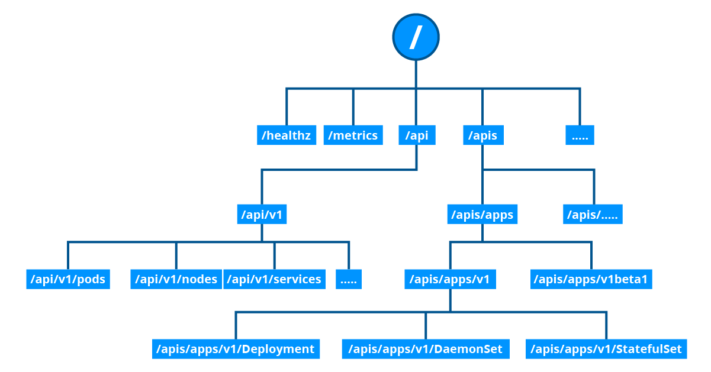

Accessing Minikube

Any healthy running Kubernetes cluster can be accessed via any one of the following methods: Command Line Interface (CLI) tools and scripts, web-based User Interface (Web UI) from a web browser, APIs from CLI or programmatically.

These methods are applicable to all Kubernetes clusters.

Command Line Interface (CLI)

kubectl is the Kubernetes Command Line Interface (CLI) client to manage cluster resources and applications. It is very flexible and easy to integrate with other systems, therefore it can be used standalone, or part of scripts and automation tools. Once all required credentials and cluster access points have been configured for kubectl, it can be used remotely from anywhere to access a cluster.

We will be using kubectl extensively to deploy applications, manage and configure Kubernetes resources.

Web-based User Interface (Web UI)

The Kubernetes Dashboard provides a Web-based User Interface (Web UI) to interact with a Kubernetes cluster to manage resources and containerized applications. While not as flexible as the kubectl CLI client tool, it is still a preferred tool to users who are not as proficient with the CLI.

APIs

The main component of the Kubernetes control plane is the API Server, responsible for exposing the Kubernetes APIs. The APIs allow operators and users to directly interact with the cluster. Using both CLI tools and the Dashboard UI, we can access the API server running on the control plane node to perform various operations to modify the cluster's state. The API Server is accessible through its endpoints by agents and users possessing the required credentials.

Below, we can see the representation of the HTTP API directory tree of Kubernetes:

HTTP API directory tree of Kubernetes can be divided into three independent group types:

    Core group (/api/v1)
    This group includes objects such as Pods, Services, Nodes, Namespaces, ConfigMaps, Secrets, etc.
    Named group
    This group includes objects in /apis/$NAME/$VERSION format. These different API versions imply different levels of stability and support:
    - Alpha level - it may be dropped at any point in time, without notice. For example, /apis/batch/v2alpha1.
    - Beta level - it is well-tested, but the semantics of objects may change in incompatible ways in a subsequent beta or stable release. For example, /apis/certificates.k8s.io/v1beta1.
    - Stable level - appears in released software for many subsequent versions. For example, /apis/networking.k8s.io/v1.
    System-wide
    This group consists of system-wide API endpoints, like /healthz, /logs, /metrics, /ui, etc.

We can access an API Server either directly by calling the respective API endpoints, using the CLI tools, or the Dashboard UI.

Next, we will see how we can access the Minikube Kubernetes cluster we set up in the previous chapter.

kubectl

kubectl allows us to manage local Kubernetes clusters like the Minikube cluster, or remote clusters deployed in the cloud. It is generally installed before installing and starting Minikube, but it can also be installed after the cluster bootstrapping step.

A Minikube installation has its own kubectl CLI installed and ready to use. However, it is somewhat inconvenient to use as the kubectl command becomes a subcommand of the minikube command. Users would be required to type longer commands, such as minikube kubectl -- <subcommand> <object-type> <object-name> -o --option, instead of just kubectl <subcommand> <object-type> <object-name> -o --option. While a simple solution would be to set up an alias, the recommendation is to run the kubectl CLI tool as a standalone installation.

Once separately installed, kubectl receives its configuration automatically for Minikube Kubernetes cluster access. However, in different Kubernetes cluster setups, we may need to manually configure the cluster access points and certificates required by kubectl to securely access the cluster.

There are different methods that can be used to install kubectl listed in the Kubernetes documentation. For best results, it is recommended to keep kubectl within one minor version of the desired Kubernetes release. Next, we will describe the kubectl CLI installation process.

Additional details about the kubectl command line client can be found in the kubectl book, the Kubernetes official documentation, or its GitHub repository.

Installing kubectl on Linux

To install kubectl on Linux, follow the instructions below extracted from the official installation guide.

Download and install the latest stable kubectl binary:

$ curl -LO "htt‌‌ps://dl.k8s.io/release/$(curl -L -s \
htt‌‌ps://dl.k8s.io/release/stable.txt)/bin/linux/amd64/kubectl"

$ sudo install -o root -g root -m 0755 kubectl /usr/local/bin/kubectl

Where ht‌tps://dl.k8s.io/release/stable.txt aims to display the latest Kubernetes stable release version.

NOTE: To download and set up a specific version of kubectl (such as v1.28.3) to be aligned with the Kubernetes version of the Minikube cluster, issue the following command instead:

$ curl -LO ht‌‌tps://dl.k8s.io/release/v1.28.3/bin/linux/amd64/kubectl

The installed version can be verified with:

$ kubectl version --client

A typical helpful post-installation configuration is to enable shell autocompletion for kubectl. For bash shell it can be achieved by running the following sequence of commands:

$ sudo apt update && sudo apt install -y bash-completion

$ source /usr/share/bash-completion/bash_completion

$ source <(kubectl completion bash)

$ echo 'source <(kubectl completion bash)' >> ~/.bashrc

kubectl Configuration File

To access the Kubernetes cluster, the kubectl client needs the control plane node endpoint and appropriate credentials to be able to securely interact with the API Server running on the control plane node. While starting Minikube, the startup process creates, by default, a configuration file, config, inside the .kube directory (often referred to as the kubeconfig), which resides in the user's home directory. The configuration file has all the connection details required by kubectl. By default, the kubectl binary parses this file to find the control plane node's connection endpoint, along with the required credentials. Multiple kubeconfig files can be configured with a single kubectl client. To look at the connection details, we can either display the content of the ~/.kube/config file (on Linux) or run the following command (the output is redacted for readability):

$ kubectl config view

apiVersion: v1
clusters:
- cluster:
    certificate-authority: /home/student/.minikube/ca.crt
    server: htt‌ps://192.168.99.100:8443
  name: minikube
contexts:
- context:
    cluster: minikube
    user: minikube
  name: minikube
current-context: minikube
kind: Config
preferences: {}
users:
- name: minikube
  user:
    client-certificate: /home/student/.minikube/profiles/minikube/client.crt
    client-key: /home/student/.minikube/profiles/minikube/client.key

The kubeconfig includes the API Server's endpoint server: ht‌t‌ps://192.168.99.100:8443 and the minikube user's client authentication key and certificate data.

Once kubectl is installed, we can display information about the Minikube Kubernetes cluster with the kubectl cluster-info command:

$ kubectl cluster-info

Kubernetes master is running at htt‌‌ps://192.168.99.100:8443
KubeDNS is running at htt‌‌ps://192.168.99.100:8443/api/v1/namespaces/kube-system/services/kube-dns:dns/proxy

To further debug and diagnose cluster problems, use 'kubectl cluster-info dump'.

You can find more details about the kubectl command line options here.

Although for the Kubernetes cluster installed by Minikube the ~/.kube/config file gets created automatically, this is not the case for Kubernetes clusters installed by other tools. In other cases, the config file has to be created manually and sometimes re-configured to suit various networking and client/server setups.

Kubernetes Dashboard

The Kubernetes Dashboard provides a web-based user interface for Kubernetes cluster management. Minikube installs the Dashboard as an addon, but it is disabled by default. Prior to using the Dashboard we are required to enable the Dashboard addon, together with the metrics-server addon, a helper addon designed to collect usage metrics from the Kubernetes cluster. To access the dashboard from Minikube, we can use the minikube dashboard command, which opens a new tab in our web browser displaying the Kubernetes Dashboard, but only after we list, enable required addons, and verify their state:

$ minikube addons list

$ minikube addons enable metrics-server

$ minikube addons enable dashboard

$ minikube addons list

$ minikube dashboard 

 

Kubernetes Dashboard User Interface

Kubernetes Dashboard User Interface

 

NOTE: In case the browser is not opening another tab and does not display the Dashboard as expected, verify the output in your terminal as it may display a URL for the Dashboard (together with some Error messages). If the URL is not displayed, we can request it to be displayed with the following command:

$ minikube dashboard --url

Copy and paste the displayed URL in a new tab of your browser. Depending on your terminal's features you may be able to just click or right-click the URL to open directly in the browser.

After a logout/login or a reboot of your workstation the expected behavior may be observed (where the minikube dashboard command directly opens a new tab in your browser displaying the Dashboard).

APIs with 'kubectl proxy'

Issuing the kubectl proxy command, kubectl authenticates with the API server on the control plane node and makes services available on the default proxy port 8001.

First, we issue the kubectl proxy command:

$ kubectl proxy

Starting to serve on 127.0.0.1:8001

It locks the terminal for as long as the proxy is running, unless we run it in the background (with kubectl proxy &).

When kubectl proxy is running, we can send requests to the API over the localhost on the default proxy port 8001 (from another terminal, since the proxy locks the first terminal when running in foreground):

$ curl http://localhost:8001/

{
 "paths": [
   "/api",
   "/api/v1",
   "/apis",
   "/apis/apps",
   ......
   ......
   "/logs",
   "/metrics",
   "/openapi/v2",
   "/version"
 ]
}

With the above curl request, we requested all the API endpoints from the API server. Clicking on the link above (in the curl command), it will open the same listing output in a browser tab.

We can explore several path combinations with curl or in a browser as well, such as:

http://localhost:8001/api/v1

http://localhost:8001/apis/apps/v1

http://localhost:8001/healthz

http://localhost:8001/metrics

APIs with Authentication

When not using the kubectl proxy, we need to authenticate to the API Server when sending API requests. We can authenticate by providing a Bearer Token when issuing a curl command, or by providing a set of keys and certificates.

A Bearer Token is an access token that can be generated by the authentication server (the API Server on the control plane node) at the client's request. Using that token, the client can securely communicate with the Kubernetes API Server without providing additional authentication details, and then, access resources. The token may need to be provided again for subsequent resource access requests. 

Let's create an access token for the default ServiceAccount, and grant special permission to access the root directory of the API (special permission that was not necessary when the kubectl proxy was used earlier). The special permission will be set through a Role Based Access Control (RBAC) policy. The policy is the clusterrole defined below, which is granted through the clusterrolebinding definition (RBAC, clusterroles, and clusterrolebindings will be discussed in a later chapter). The special permission is only needed to access the root directory of the API, but not needed to access /api, /apis, or other subdirectories:

$ export TOKEN=$(kubectl create token default)

$ kubectl create clusterrole api-access-root --verb=get --non-resource-url=/*

$ kubectl create clusterrolebinding api-access-root --clusterrole api-access-root --serviceaccount=default:default

Retrieve the API Server endpoint:

$ export APISERVER=$(kubectl config view | grep https | cut -f 2- -d ":" | tr -d " ")

Confirm that the APISERVER stored the same IP as the Kubernetes control plane IP by issuing the following two commands and comparing their outputs:

$ echo $APISERVER

htt‌ps://192.168.99.100:8443

$ kubectl cluster-info

Kubernetes control plane is running at htt‌ps://192.168.99.100:8443 ...

Access the API Server using the curl command, as shown below:

$ curl $APISERVER --header "Authorization: Bearer $TOKEN" --insecure

{
 "paths": [
   "/api",
   "/api/v1",
   "/apis",
   "/apis/apps",
   ......
   ......
   "/logs",
   "/metrics",
   "/openapi/v2",
   "/version"
 ]
}

We can run additional curl commands to retrieve details about specific API groups as follows. These commands should work even without the special permission defined above and granted to the default ServiceAccount associated with the access token: 

$ curl $APISERVER/api/v1 --header "Authorization: Bearer $TOKEN" --insecure

$ curl $APISERVER/apis/apps/v1 --header "Authorization: Bearer $TOKEN" --insecure

$ curl $APISERVER/healthz --header "Authorization: Bearer $TOKEN" --insecure

$ curl $APISERVER/metrics --header "Authorization: Bearer $TOKEN" --insecure

Instead of the access token, we can extract the client certificate, client key, and certificate authority data from the .kube/config file. Once extracted, they can be encoded and then passed with a curl command for authentication. The new curl command would look similar to the example below. Keep in mind, however, that the example command below would only work with the base 64 encoded client certificate, key and certificate authority data, and it is provided only for illustrative purposes.

$ curl $APISERVER --cert encoded-cert --key encoded-key --cacert encoded-ca

