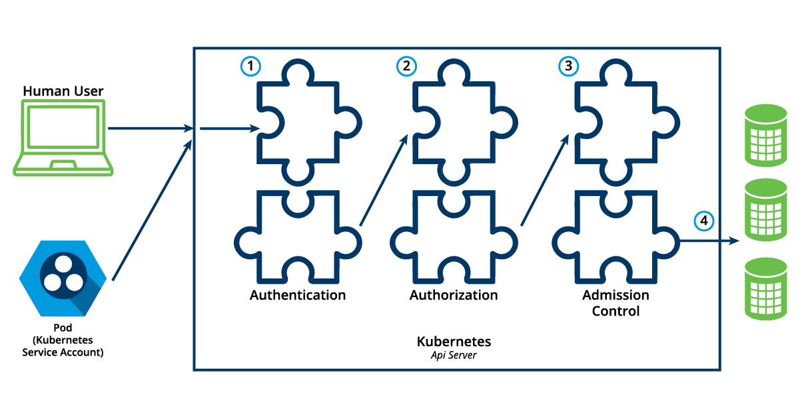

Authentication, Authorization, and Admission Control - Overview

To access and manage Kubernetes resources or objects in the cluster, we need to access a specific API endpoint on the API server. Each access request goes through the following access control stages:

    Authentication
    Authenticate a user based on credentials provided as part of API requests.
    Authorization
    Authorizes the API requests submitted by the authenticated user.
    Admission Control
    Software modules that validate and/or modify user requests.

The following image depicts the above stages:

Authentication

Kubernetes does not have an object called user, nor does it store usernames or other related details in its object store. However, even without that, Kubernetes can use usernames for the Authentication phase of the API access control, and to request logging as well.

Kubernetes supports two kinds of users:

    Normal Users
    They are managed outside of the Kubernetes cluster via independent services like User/Client Certificates, a file listing usernames/passwords, Google accounts, etc.
    Service Accounts
    Service Accounts allow in-cluster processes to communicate with the API server to perform various operations. Most of the Service Accounts are created automatically via the API server, but they can also be created manually. The Service Accounts are tied to a particular Namespace and mount the respective credentials to communicate with the API server as Secrets.

If properly configured, Kubernetes can also support anonymous requests, along with requests from Normal Users and Service Accounts. User impersonation is also supported allowing a user to act as another user, a helpful feature for administrators when troubleshooting authorization policies.

For authentication, Kubernetes uses a series of authentication modules:

    X509 Client Certificates
    To enable client certificate authentication, we need to reference a file containing one or more certificate authorities by passing the --client-ca-file=SOMEFILE option to the API server. The certificate authorities mentioned in the file would validate the client certificates presented by users to the API server. A demonstration video covering this topic can be found at the end of this chapter.
    Static Token File
    We can pass a file containing pre-defined bearer tokens with the --token-auth-file=SOMEFILE option to the API server. Currently, these tokens would last indefinitely, and they cannot be changed without restarting the API server.
    Bootstrap Tokens
    Tokens used for bootstrapping new Kubernetes clusters.
    Service Account Tokens
    Automatically enabled authenticators that use signed bearer tokens to verify requests. These tokens get attached to Pods using the Service Account Admission Controller, which allows in-cluster processes to talk to the API server.
    OpenID Connect Tokens
    OpenID Connect helps us connect with OAuth2 providers, such as Microsoft Entra ID (previously known as Azure Active Directory), Salesforce, and Google, to offload the authentication to external services.
    Webhook Token Authentication
    With Webhook-based authentication, verification of bearer tokens can be offloaded to a remote service.
    Authenticating Proxy
    Allows for the programming of additional authentication logic.

We can enable multiple authenticators, and the first module to successfully authenticate the request short-circuits the evaluation. To ensure successful user authentication, we should enable at least two methods: the service account tokens authenticator and one of the user authenticators.

Authorization

After a successful authentication, users can send the API requests to perform different operations. Here, these API requests get authorized by Kubernetes using various authorization modules that allow or deny the requests.

Some of the API request attributes that are reviewed by Kubernetes include user, group, Resource, Namespace, or API group, to name a few. Next, these attributes are evaluated against policies. If the evaluation is successful, then the request is allowed, otherwise it is denied. Similar to the Authentication step, Authorization has multiple modules, or authorizers. More than one module can be configured for one Kubernetes cluster, and each module is checked in sequence. If any authorizer approves or denies a request, then that decision is returned immediately.

Authorization Modes

    Node

    Node authorization is a special-purpose authorization mode which specifically authorizes API requests made by kubelets. It authorizes the kubelet's read operations for services, endpoints, or nodes, and writes operations for nodes, pods, and events. For more details, please review the Node authorization documentation.
    
   Attribute-Based Access Control (ABAC)

With the ABAC authorizer, Kubernetes grants access to API requests, which combine policies with attributes. In the following example, user bob can only read Pods in the Namespace lfs158.

{
  "apiVersion": "abac.authorization.kubernetes.io/v1beta1",
  "kind": "Policy",
  "spec": {
    "user": "bob",
    "namespace": "lfs158",
    "resource": "pods",
    "readonly": true
  }
}

To enable ABAC mode, we start the API server with the --authorization-mode=ABAC option, while specifying the authorization policy with --authorization-policy-file=PolicyFile.json. For more details, please review the ABAC authorization documentation.
Webhook

In Webhook mode, Kubernetes can request authorization decisions to be made by third-party services, which would return true for successful authorization, and false for failure. In order to enable the Webhook authorizer, we need to start the API server with the --authorization-webhook-config-file=SOME_FILENAME option, where SOME_FILENAME is the configuration of the remote authorization service. For more details, please see the Webhook mode documentation.
Role-Based Access Control (RBAC)

In general, with RBAC we regulate the access to resources based on the Roles of individual users. In Kubernetes, multiple Roles can be attached to subjects like users, service accounts, etc. While creating the Roles, we restrict resource access by specific operations, such as create, get, update, patch, etc. These operations are referred to as verbs. In RBAC, we can create two kinds of Roles:

    Role
    A Role grants access to resources within a specific Namespace.
    ClusterRole
    A ClusterRole grants the same permissions as Role does, but its scope is cluster-wide.

In this course, we will focus on the first kind, Role. Below you will find an example:

apiVersion: rbac.authorization.k8s.io/v1
kind: Role
metadata:
  namespace: lfs158
  name: pod-reader
rules:
- apiGroups: [""] # "" indicates the core API group
  resources: ["pods"]
  verbs: ["get", "watch", "list"]

The manifest defines a pod-reader role, which has access only to read the Pods of lfs158 Namespace.

For comparison, a ClusterRole example is provided below:

apiVersion: rbac.authorization.k8s.io/v1
kind: ClusterRole
metadata:
  name: cluster-admin
rules:
- apiGroups:
  - '*' # All API groups
  resources:
  - '*' # All resources
  verbs:
  - '*' # All operations
- nonResourceURLs:
  - '*' # All non resource URLs, such as "/healthz"
  verbs:
  - '*' # All operations

The manifest defines a cluster-admin cluster role that is fully permissive.

Once the role is created, we can bind it to users with a RoleBinding object. There are two kinds of RoleBindings:

    RoleBinding
    It allows us to bind users to the same namespace as a Role. We could also refer to a ClusterRole in RoleBinding, which would grant permissions to Namespace resources defined in the ClusterRole within the RoleBinding’s Namespace.
    ClusterRoleBinding
    It allows us to grant access to resources at a cluster-level and to all Namespaces.

In this course, we will focus on the first kind RoleBinding. Below, you will find an example:

apiVersion: rbac.authorization.k8s.io/v1
kind: RoleBinding
metadata:
  name: pod-read-access
  namespace: lfs158
subjects:
- kind: User
  name: bob
  apiGroup: rbac.authorization.k8s.io
roleRef:
  kind: Role
  name: pod-reader
  apiGroup: rbac.authorization.k8s.io

The manifest defines a bind between the pod-reader Role and user bob, to restrict the user to only read the Pods of the lfs158 Namespace.

For comparison, a ClusterRoleBinding example is provided below:

apiVersion: rbac.authorization.k8s.io/v1
kind: ClusterRoleBinding
metadata:
  name: cluster-admin
roleRef:
  apiGroup: rbac.authorization.k8s.io
  kind: ClusterRole
  name: cluster-admin
subjects:
- apiGroup: rbac.authorization.k8s.io
  kind: Group
  name: system:admins

The manifest defines a bind between the cluster-admin ClusterRole and all users of the group system:admins.

To enable the RBAC mode, we start the API server with the --authorization-mode=RBAC option, allowing us to dynamically configure policies. For more details, please review the RBAC mode.

Authentication and Authorization Demo Guide (1)

This exercise guide assumes the following environment, which by default uses the certificate and key from /var/lib/minikube/certs/, and RBAC mode for authorization:

    Minikube v1.32
    Kubernetes v1.28
    containerd 1.7.8

This exercise guide was prepared for the video demonstration available at the end of this chapter.

Start Minikube:

$ minikube start

View the content of the kubectl client's configuration manifest, observing the only context minikube and the only user minikube, created by default (the output has been redacted for readability):

$ kubectl config view

apiVersion: v1
clusters:
- cluster:
    certificate-authority: /home/student/.minikube/ca.crt
    server: ht‌tps://192.168.99.100:8443
  name: minikube
contexts:
- context:
    cluster: minikube
    namespace: default
    user: minikube
  name: minikube
current-context: minikube
kind: Config
preferences: {}
users:
- name: minikube
  user:
    client-certificate: /home/student/.minikube/profiles/minikube/client.crt
    client-key: /home/student/.minikube/profiles/minikube/client.key
    
    
    
    Authentication and Authorization Demo Guide (2)

Create lfs158 namespace:

$ kubectl create namespace lfs158

namespace/lfs158 created

Create the rbac directory and cd into it:

$ mkdir rbac

$ cd rbac/

Create a new user bob on your workstation, and set bob's password as well (the system will prompt you to enter the password twice) :

~/rbac$ sudo useradd -s /bin/bash bob

~/rbac$ sudo passwd bob

Create a private key for the new user bob with the openssl tool, then create a certificate signing request for bob with the same openssl tool:

~/rbac$ openssl genrsa -out bob.key 2048

Generating RSA private key, 2048 bit long modulus (2 primes)
.................................................+++++
.........................+++++
e is 65537 (0x010001)

~/rbac$ openssl req -new -key bob.key \
  -out bob.csr -subj "/CN=bob/O=learner"

Create a YAML definition manifest for a certificate signing request object, and save it with a blank value for the request field: 

~/rbac$ vim signing-request.yaml

apiVersion: certificates.k8s.io/v1
kind: CertificateSigningRequest
metadata:
  name: bob-csr
spec:
  groups:
  - system:authenticated
  request: <assign encoded value from next cat command>
  signerName: kubernetes.io/kube-apiserver-client
  usages:
  - digital signature
  - key encipherment
  - client auth
  
  
  Authentication and Authorization Demo Guide (3)

View the certificate, encode it in base64, and assign it to the request field in the signing-request.yaml file:

~/rbac$ cat bob.csr | base64 | tr -d '\n','%'

LS0tLS1CRUd...1QtLS0tLQo=

~/rbac$ vim signing-request.yaml

apiVersion: certificates.k8s.io/v1
kind: CertificateSigningRequest
metadata:
  name: bob-csr
spec:
  groups:
  - system:authenticated
  request: LS0tLS1CRUd...1QtLS0tLQo=
  signerName: kubernetes.io/kube-apiserver-client
  usages:
  - digital signature
  - key encipherment
  - client auth

Create the certificate signing request object, then list the certificate signing request objects. It shows a pending state:

~/rbac$ kubectl create -f signing-request.yaml

certificatesigningrequest.certificates.k8s.io/bob-csr created

~/rbac$ kubectl get csr

NAME      AGE   SIGNERNAME                            REQUESTOR       CONDITION
bob-csr   12s   kubernetes.io/kube-apiserver-client   minikube-user   Pending

Approve the certificate signing request object, then list the certificate signing request objects again. It shows both approved and issued states:

~/rbac$ kubectl certificate approve bob-csr

certificatesigningrequest.certificates.k8s.io/bob-csr approved

~/rbac$ kubectl get csr

NAME      AGE   SIGNERNAME                            REQUESTOR       CONDITION
bob-csr   57s   kubernetes.io/kube-apiserver-client   minikube-user   Approved,Issued

Authentication and Authorization Demo Guide (4)

Extract the approved certificate from the certificate signing request, decode it with base64 and save it as a certificate file. Then view the certificate in the newly created certificate file:

~/rbac$ kubectl get csr bob-csr \
  -o jsonpath='{.status.certificate}' | \
  base64 -d > bob.crt

~/rbac$ cat bob.crt

-----BEGIN CERTIFICATE-----
MIIDGzCCA...
...
...NOZRRZBVunTjK7A==
-----END CERTIFICATE-----

Configure the kubectl client's configuration manifest with user bob's credentials by assigning his key and certificate: 

~/rbac$ kubectl config set-credentials bob \
  --client-certificate=bob.crt --client-key=bob.key

User "bob" set.

Create a new context entry in the kubectl client's configuration manifest for user bob, associated with the lfs158 namespace in the minikube cluster:

~/rbac$ kubectl config set-context bob-context \
  --cluster=minikube --namespace=lfs158 --user=bob

Context "bob-context" created.

View the contents of the kubectl client's configuration manifest again, observing the new context entry bob-context, and the new user entry bob (the output is redacted for readability):

~/rbac$ kubectl config view

apiVersion: v1
clusters:
- cluster:
    certificate-authority: /home/student/.minikube/ca.crt
    ...
    server: ht‌tps://192.168.99.100:8443
  name: minikube
contexts:
- context:
    cluster: minikube
    ...
    user: minikube
  name: minikube
- context:
    cluster: minikube
    namespace: lfs158
    user: bob
  name: bob-context
current-context: minikube
kind: Config
preferences: {}
users:
- name: minikube
  user:
    client-certificate: /home/student/.minikube/profiles/minikube/client.crt
    client-key: /home/student/.minikube/profiles/minikube/client.key
- name: bob
  user:
    client-certificate: /home/student/rbac/bob.crt
    client-key: /home/student/rbac/bob.key
    
    Authentication and Authorization Demo Guide (5)

While in the default minikube context, create a new deployment in the lfs158 namespace:

~/rbac$ kubectl -n lfs158 create deployment nginx --image=nginx:alpine

deployment.apps/nginx created

From the new context bob-context try to list pods. The attempt fails because user bob has no permissions configured for the bob-context:

~/rbac$ kubectl --context=bob-context get pods

Error from server (Forbidden): pods is forbidden: User "bob" cannot list resource "pods" in API group "" in the namespace "lfs158"

The following steps will assign a limited set of permissions to user bob in the bob-context. 

Create a YAML configuration manifest for a pod-reader Role object, which allows only get, watch, list actions/verbs in the lfs158 namespace against pod resources. Then create the role object and list it from the default minikube context, but from the lfs158 namespace:

~/rbac$ vim role.yaml

apiVersion: rbac.authorization.k8s.io/v1
kind: Role
metadata:
  name: pod-reader
  namespace: lfs158
rules:
- apiGroups: [""]
  resources: ["pods"]
  verbs: ["get", "watch", "list"]

~/rbac$ kubectl create -f role.yaml

role.rbac.authorization.k8s.io/pod-reader created

~/rbac$ kubectl -n lfs158 get roles

NAME         CREATED AT
pod-reader   2022-04-11T03:47:45Z

Authentication and Authorization Demo Guide (6)

Create a YAML configuration manifest for a rolebinding object, which assigns the permissions of the pod-reader Role to user bob. Then create the rolebinding object and list it from the default minikube context, but from the lfs158 namespace:

~/rbac$ vim rolebinding.yaml

apiVersion: rbac.authorization.k8s.io/v1
kind: RoleBinding
metadata:
  name: pod-read-access
  namespace: lfs158
subjects:
- kind: User
  name: bob
  apiGroup: rbac.authorization.k8s.io
roleRef:
  kind: Role
  name: pod-reader
  apiGroup: rbac.authorization.k8s.io

~/rbac$ kubectl create -f rolebinding.yaml 

rolebinding.rbac.authorization.k8s.io/pod-read-access created

~/rbac$ kubectl -n lfs158 get rolebindings

NAME              ROLE              AGE
pod-read-access   Role/pod-reader   28s

Now that we have assigned permissions to bob, we can successfully list pods from the new context bob-context.

~/rbac$ kubectl --context=bob-context get pods

NAME                     READY   STATUS    RESTARTS   AGE
nginx-565785f75c-kl25r   1/1     Running   0          7m41s

Admission Control

Admission controllers are used to specify granular access control policies, which include allowing privileged containers, checking on resource quota, etc. We force these policies using different admission controllers, like LimitRanger, ResourceQuota, DefaultStorageClass, AlwaysPullImages, etc. They come into effect only after API requests are authenticated and authorized. Admission controllers fall under two categories - validating or mutating, but there are controllers that are both validating and mutating. The mutating controllers can modify the requested objects.

To use admission controls, we must start the Kubernetes API server with the --enable-admission-plugins, which takes a comma-delimited, ordered list of controller names, such as:

--enable-admission-plugins=NamespaceLifecycle,ResourceQuota,PodSecurity,DefaultStorageClass

Kubernetes has some admission controllers enabled by default. For more details, please review the list of admission controllers.

Kubernetes admission control can also be implemented though custom plugins, for a dynamic admission control method. These plugins are developed as extensions and run as admission webhooks.

 
